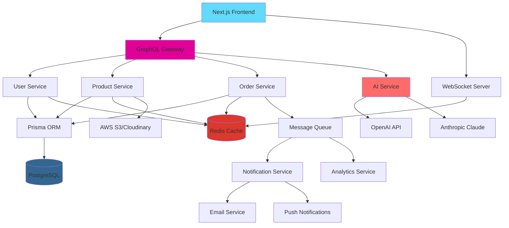

<div align="center">

</div>

<br />

<div align="center">

## ShopSmart – AI-Powered Full-Stack E-Commerce Platform  
**A Microservices-Driven, Real-Time Commerce Experience with Advanced AI Integration**

**Author:** Ishita Singh

</div>

---

### Overview

ShopSmart is a **scalable, microservices-based e-commerce platform** that prioritizes **real-time capabilities, advanced AI personalization, and seamless multi-vendor operations**. Built with TypeScript across the stack, GraphQL for flexible data fetching, and a containerized deployment strategy, ShopSmart is designed to handle enterprise-scale traffic while delivering hyper-personalized shopping experiences.

---

### Vision

**Create a commerce platform that learns, adapts, and anticipates user needs in real-time.**

ShopSmart's vision centers on **real-time personalization** and **intelligent automation**. By leveraging event-driven architecture, WebSocket connections, and continuous AI model updates, ShopSmart transforms shopping from a transactional experience into a **conversational, context-aware journey** that evolves with each interaction.

---

### Objectives

- **Microservices Architecture**
  - Design a **modular, independently deployable** service architecture (user-service, product-service, order-service, ai-service, notification-service).
- **TypeScript-First Development**
  - Use **TypeScript** across frontend and backend for type safety, better DX, and reduced runtime errors.
- **GraphQL API Layer**
  - Implement **GraphQL** with Apollo Server/Client for flexible, efficient data fetching and reduced over-fetching.
- **Real-Time Capabilities**
  - Integrate **WebSockets** for live inventory updates, order tracking, chat support, and real-time recommendations.
- **Advanced AI Integration**
  - Build a dedicated **AI service** using OpenAI/Claude APIs for multi-modal search (text + image), dynamic pricing, and predictive inventory management.
- **Event-Driven Communication**
  - Use **message queues** (Redis/RabbitMQ) for async processing, event sourcing for audit trails, and decoupled service communication.
- **Modern UI Framework**
  - Leverage **Next.js 14+** with App Router, **Tailwind CSS**, and **Radix UI** for server-side rendering, SEO optimization, and component flexibility.
- **Containerized Deployment**
  - Deploy using **Docker** and **Kubernetes** (or Docker Compose for dev) with CI/CD pipelines via GitHub Actions.
- **Comprehensive Testing**
  - Implement **unit, integration, and E2E tests** with Jest, Supertest, and Playwright for reliability.

---

### Demo

> Planned demo showcasing real-time features, AI-powered search, and multi-vendor dashboard interactions.

<video src="docs/demo.mp4" controls width="720"></video>

---

### Tech Stack

| Layer              | Technology                    | Rationale                                           |
| ------------------ | ----------------------------- | --------------------------------------------------- |
| **Frontend**       | Next.js 14+ (App Router)     | SSR, SEO, server components, optimized performance  |
| **UI Components**  | Tailwind CSS + Radix UI      | Utility-first styling, accessible primitives        |
| **Backend**        | Node.js + Express (TypeScript)| Type-safe, familiar, performant                     |
| **API Layer**      | GraphQL (Apollo Server)      | Flexible queries, reduced over-fetching            |
| **ORM / Data**     | Prisma ORM                    | Type-safe DB access, migrations, productivity       |
| **Database**       | PostgreSQL                    | ACID compliance, relational integrity, JSON support|
| **Cache**          | Redis                         | Session storage, real-time data, rate limiting      |
| **Message Queue**  | Redis/RabbitMQ                | Async processing, event-driven architecture         |
| **Real-Time**      | Socket.io                     | WebSocket connections for live updates              |
| **Auth**           | NextAuth.js + JWT             | OAuth providers, secure session management         |
| **AI Services**    | OpenAI API + Anthropic Claude | Multi-model AI for diverse use cases               |
| **File Storage**   | AWS S3 / Cloudinary           | Scalable image/product asset management             |
| **Deployment**     | Docker + Kubernetes           | Containerized, scalable, production-ready           |
| **CI/CD**          | GitHub Actions                | Automated testing and deployment                    |

---

### Features

#### Shopper Features

- **Multi-Modal AI Search**
  - Natural language queries, **image-based product search**, voice search support, and semantic understanding.
- **Real-Time Personalization**
  - **Live recommendation updates** based on browsing behavior, cart abandonment triggers, and contextual suggestions.
- **Smart Cart & Wishlist**
  - **Price drop alerts**, cross-seller bundling suggestions, and AI-powered "complete the look" recommendations.
- **Live Order Tracking**
  - **Real-time order status** updates via WebSocket, delivery ETA predictions, and interactive tracking map.
- **Social Shopping**
  - Share wishlists, **collaborative carts**, and see what friends are buying (privacy-controlled).
- **AI Shopping Assistant**
  - **Conversational chatbot** that helps find products, compares options, and answers questions in natural language.

#### Seller Features

- **Multi-Vendor Dashboard**
  - Manage multiple stores, **bulk operations**, and unified analytics across all stores.
- **AI-Powered Inventory Management**
  - **Predictive restocking** alerts, demand forecasting, and automated reorder suggestions.
- **Dynamic Pricing Engine**
  - **AI-suggested pricing** based on market trends, competitor analysis, and demand elasticity.
- **Advanced Analytics**
  - Real-time sales dashboards, **customer behavior heatmaps**, conversion funnel analysis, and A/B testing tools.
- **Automated Product Descriptions**
  - **AI-generated product descriptions** in multiple languages, SEO-optimized titles, and marketing copy.
- **Live Chat Integration**
  - Built-in **customer support chat** with AI-powered auto-responses and escalation to human agents.

#### Admin Features

- **Platform Analytics**
  - System-wide metrics, **real-time monitoring**, service health dashboards, and performance analytics.
- **AI Fraud Detection**
  - **Real-time fraud scoring**, suspicious transaction alerts, and automated account flagging.
- **Content Moderation**
  - **AI-powered review moderation**, spam detection, and automated product listing quality checks.
- **Multi-Tenant Management**
  - User roles, permissions, **vendor onboarding workflows**, and platform configuration.
- **Event Logging & Auditing**
  - Complete audit trail with **event sourcing**, searchable logs, and compliance reporting.

---

### AI Capabilities

#### Natural Language Processing

- **Semantic Search**: Understands intent, synonyms, and context beyond keyword matching.
- **Query Expansion**: Automatically suggests related searches and filters.
- **Multi-Language Support**: Search and recommendations in multiple languages.

#### Recommendation Engine

- **Collaborative Filtering**: "Users who bought X also bought Y" with real-time updates.
- **Content-Based Filtering**: Recommendations based on product attributes and user preferences.
- **Hybrid Approach**: Combines multiple algorithms for optimal accuracy.
- **Contextual Recommendations**: Time-based, location-based, and event-driven suggestions.

#### Advanced AI Features

- **Image Recognition**: Upload an image to find similar products.
- **Sentiment Analysis**: Analyze product reviews and customer feedback in real-time.
- **Predictive Analytics**: Forecast demand, optimize inventory, and predict churn.
- **Dynamic Pricing**: AI-suggested pricing adjustments based on market conditions.
- **Fake Listing Detection**: Identify suspicious products using pattern recognition and anomaly detection.
- **Chatbot Assistant**: Natural language shopping assistant with product knowledge.

---

### Architecture



---

### Data Model (Prisma Schema Highlights)

```prisma
// Core Models
model User {
  id            String   @id @default(cuid())
  email         String   @unique
  name          String?
  role          Role     @default(SHOPPER)
  authProvider  String?
  createdAt     DateTime @default(now())
  updatedAt     DateTime @updatedAt
  
  // Relations
  orders        Order[]
  cartItems     CartItem[]
  wishlistItems WishlistItem[]
  reviews       Review[]
  stores        Store[]  // For sellers
}

model Product {
  id          String   @id @default(cuid())
  name        String
  description String?
  price       Decimal
  stock       Int
  images      String[]
  categoryId  String
  storeId     String
  aiEmbedding Json?    // For semantic search
  createdAt   DateTime @default(now())
  updatedAt   DateTime @updatedAt
  
  // Relations
  category    Category @relation(fields: [categoryId], references: [id])
  store       Store    @relation(fields: [storeId], references: [id])
  cartItems   CartItem[]
  orderItems  OrderItem[]
  reviews     Review[]
}

model Order {
  id          String      @id @default(cuid())
  userId      String
  status      OrderStatus @default(PENDING)
  total       Decimal
  shippingAddress Json
  trackingNumber String?
  createdAt   DateTime @default(now())
  updatedAt   DateTime @updatedAt
  
  // Relations
  user        User       @relation(fields: [userId], references: [id])
  items       OrderItem[]
  events      OrderEvent[] // Event sourcing
}

model Store {
  id          String   @id @default(cuid())
  name        String
  ownerId     String
  slug        String   @unique
  description String?
  createdAt   DateTime @default(now())
  
  // Relations
  owner       User     @relation(fields: [ownerId], references: [id])
  products    Product[]
}

enum Role {
  SHOPPER
  SELLER
  ADMIN
}

enum OrderStatus {
  PENDING
  CONFIRMED
  PROCESSING
  SHIPPED
  DELIVERED
  CANCELLED
}
```

---

### Development Roadmap

#### Phase 1: Foundation (Weeks 1-4)
- Set up monorepo structure with microservices
- Configure Docker development environment
- Implement Prisma schema and migrations
- Build GraphQL gateway with basic queries
- Set up Next.js frontend with Tailwind CSS
- Implement NextAuth.js authentication
- Deploy PostgreSQL and Redis instances

#### Phase 2: Core Commerce (Weeks 5-8)
- Build product catalog service with CRUD operations
- Implement shopping cart and wishlist functionality
- Create order service with payment integration (Stripe)
- Develop seller dashboard for product management
- Build admin panel for user and category management
- Add file upload service for product images
- Implement basic search functionality

#### Phase 3: AI Integration (Weeks 9-12)
- Integrate OpenAI API for product descriptions
- Build semantic search with embeddings
- Implement recommendation engine
- Add sentiment analysis for reviews
- Create AI shopping assistant chatbot
- Develop fraud detection algorithms
- Add image recognition for product search

#### Phase 4: Real-Time & Polish (Weeks 13-16)
- Implement WebSocket server for live updates
- Add real-time order tracking
- Build notification service with email/push
- Create advanced analytics dashboards
- Implement event sourcing for audit trails
- Add comprehensive testing suite
- Optimize performance and deploy to production

---

### Documentation & Git Standards

#### Documentation

- **API Documentation**: Auto-generated GraphQL schema docs with examples
- **Architecture Decision Records (ADRs)**: Document major technical decisions
- **Service Documentation**: Each microservice has its own README with setup instructions
- **Deployment Guides**: Step-by-step guides for local and production environments
- **Contributing Guidelines**: Code style, PR process, and testing requirements

#### Git Workflow

- **Branch Strategy**: Feature branches from `develop`, PRs required for `main`
- **Commit Messages**: Conventional commits (`feat:`, `fix:`, `docs:`, `refactor:`, etc.)
- **PR Template**: Includes description, testing checklist, and deployment notes
- **Code Review**: At least one approval required, automated checks must pass
- **Release Process**: Semantic versioning, tagged releases, changelog generation

---

### Conclusion

ShopSmart represents a **modern, scalable approach to e-commerce** that prioritizes **real-time user experiences** and **intelligent automation**. By leveraging microservices architecture, GraphQL flexibility, and advanced AI capabilities, ShopSmart is positioned to handle growth while continuously improving user satisfaction through personalization and automation.

The platform's **event-driven design** ensures scalability, its **TypeScript-first approach** reduces bugs, and its **comprehensive AI integration** creates a competitive advantage in the crowded e-commerce space. With a clear development roadmap and disciplined engineering practices, ShopSmart is ready to transform how users shop and how sellers operate online.

---

<div align="center">

**Built with ❤️ by Ishita Singh**

[Documentation](./docs) • [API Reference](./docs/api) • [Contributing](./CONTRIBUTING.md)

</div>
